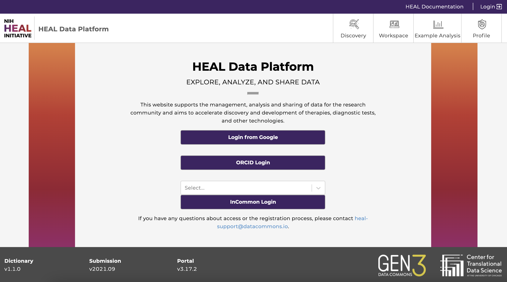

# Logging In to the Platform

You **will not** need to log in in order to:

*   _browse_ the study metadata on the Discovery Page
*   _view_ the pre-made tutorial notebooks in the “Example Analysis” tab

You **will** need to log in in order to:

*   _register_ your own study
*   _perform_ analyses in workspaces
*   _download_ data files and file manifests to your computer or workspace (you will need to obtain authorization from the host repository to access controlled data)
*   _run_ interactive tutorial notebooks in workspaces

Start by visiting the [login page](https://healdata.org/portal/login).

## Login Page Options

*   **Login from Google**: You may login using any Google account credentials, or a G-suite enabled institutional email. This option may or may not be available depending on the institution or organization the user is associated with. Users should contact the IT support to verify if this option is available. For staff, students, and faculty of the University of Chicago, more information can be found [here](https://uchicago.service-now.com/services?id=kb_article&sysparm_article=KB06000049).
*   **ORCID Login**: Users with an ORCID account can log in using their ORCID credentials.
*   **InCommon Login**: Users can login with a participating institution that is federated by InCommon. Click on “Select...” to browse and choose your institution.

After successfully logging in, your username will appear in the upper right-hand corner of the page.
