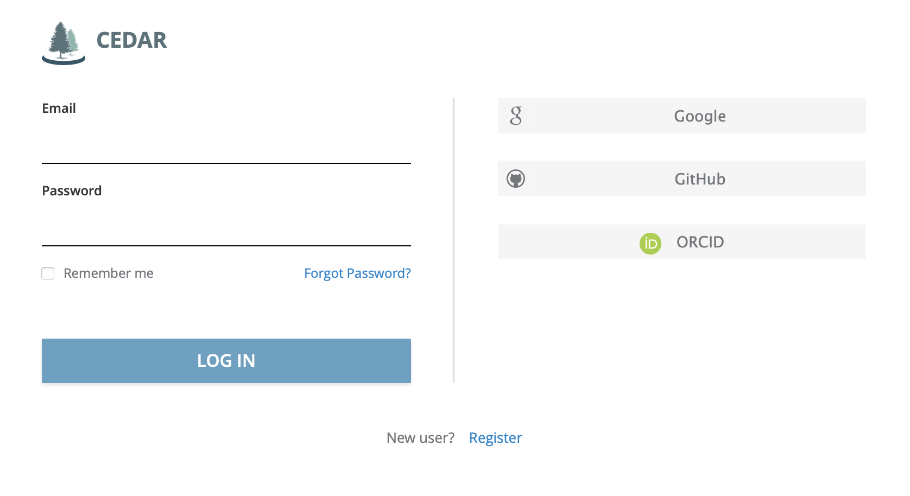
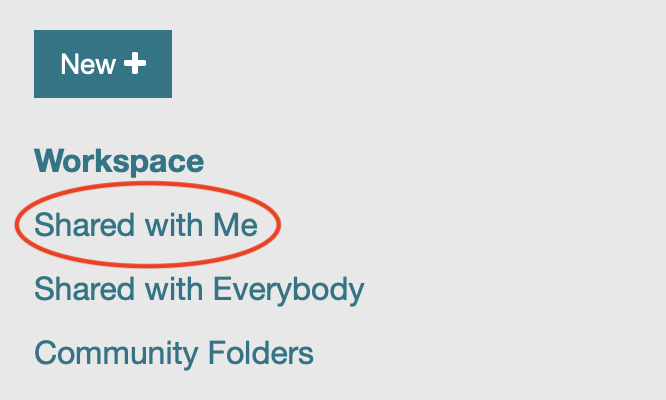
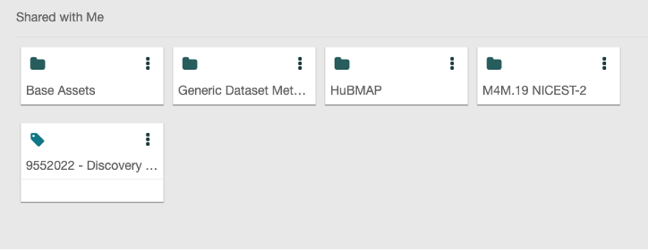

# Providing Study-Level Metadata  

[Registering your study](registering-your-study.md) on the Platform will
create a metadata input form within your CEDAR account.

The [Center for Expanded Data Annotation and Retrieval (CEDAR)
Workbench](http://cedar.metadatacenter.org/) is an online platform for
creating and managing metadata according to the FAIR principles. CEDAR is an
important part of metadata collection process for HEAL as the mechanism
through which [study-level metadata](https://github.com/HEAL/heal-metadata-schemas/blob/main/study-level-metadata-schema/schema-clean/md/study-metadata-schema-for-humans.md)
can be associated to a study entry on the HEAL Data Platform. Submission can
be completed in conjunction with registration or may be initiated at the time
of registration and augmented by revisiting the CEDAR form for your study as
the project progresses.

Step 1:  Login to your CEDAR account

Step 2: From the left-hand navigation, choose Shared with Me

{: style="height:120px;width:200px"}

Step 3:  Double-click the title for the study form you’d like to open

Step 4: Complete as much of the form as you can with currently available
information. *When you enter additional data into the CEDAR form, be sure to
SAVE your changes by scrolling to the bottom of the form.*

Information about the study-level metadata schema can be found [here](https://github.com/HEAL/heal-metadata-schemas/tree/main/study-level-metadata-schema),
including a helpful ["human-readable" version](https://github.com/HEAL/heal-metadata-schemas/blob/main/study-level-metadata-schema/schema-clean/md/study-metadata-schema-for-humans.md).
