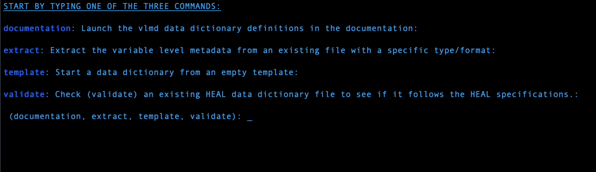
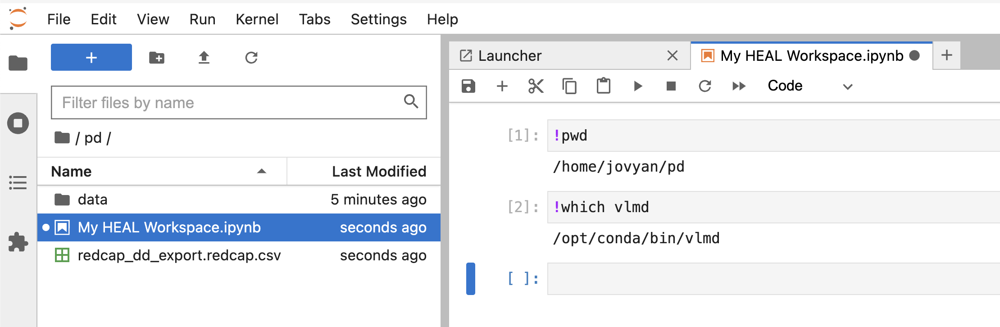

# Generate a HEAL-compliant Data Dictionary

!!! info

     The following instructions pertain to the stand-alone, executable version of the HEAL VLMD tool as well as the use of the VLMD tool in HEAL Workspaces. These two options are recommended for users who are unfamiliar with installing Python software and/or who want to generate VLMD documents in the quickest and easiest way possible. If you would like to install and integrate the VLMD tool into an existing, local pipeline, please see the HEAL Data Utilities on [GitHub](https://github.com/heal/healdata-utils) or [PyPi](https://pypi.org/project/healdata-utils/) for more information.

The HEAL VLMD tool was created to help investigators generate HEAL-compliant variable-level metadata (VLMD) documents that may be uploaded to the HEAL Data Platform. This VLMD tool uses a command-line interface (CLI), is available within HEAL Data Platform Workspaces, and can be incorporated into existing pipelines in the form of a Python module. 

---

## Using the Stand-alone VLMD Tool

In an effort to further streamline the VLMD extraction process for researchers, we have developed a stand-alone executable version of the VLMD tool. 

!!! info "Download the VLMD Tool"

     You can download the latest version of the VLMD tool for your operating system (i.e., MacOS, Windows, Linux) from the NIH HEAL Initiative’s GitHub repository:

     <p align="center">[Download Latest Software Release](https://github.com/HEAL/healdata-utils/releases/latest){ .md-button }</p>

Once you have downloaded the appropriate zip file, double-click the file to unzip the package. You should then see a file labeled `vlmd` or `vlmd.exe`, depending on your operating system and how it is configured. 

Double-clicking `vlmd` will then open your computer's command-line interface (CLI). Once the interface opens and the VLMD tool is loaded, you will be presented with four prompts: documentation, extract, start, and validate. 



### CLI Commands 

#### extract
Extract the variable level metadata from an existing file with a specific type/format

#### start
Start a data dictionary from an empty template

#### validate 
Check (validate) an existing HEAL Data Dictionary file to see if it follows the HEAL specifications after filling out a template or further annotation after extracting from a different format.

!!! info

     Typing the `documentation` command will launch the VLMD Data Dictionary definitions in the [HEAL Data Utilities documentation](https://heal.github.io/healdata-utils/vlmd/#csv-and-json-data-dictionary-definitions){:target="_blank"}.

## Using the VLMD Tool in HEAL Workspaces with Python

The VLMD tool has also been preloaded into a HEAL workspace, so that you may use it there instead of downloading it to your local machine. To request access to a workspace, see instructions [here](./heal_workspace_registration.md).

Once workspace access has been approved, select the **(Generic) Jupyter Lab Notebook with R Kernel** to get started using the VLMD tool. You can start by uploading your REDCap data dictionary or data file to the persistent drive (/pd). Any data not saved to the persistent drive will be lost when the workspace is terminated. For more information, please see our [documentation on HEAL workspaces](../platform_workspaces.md). 

{ height=”500” }

!!! info

     Users who upload files to a workspace are responsible for ensuring that they have permission and authority to do so, including adequate consent from participants and approval from their IRB. 

     Particular care must be taken with datasets containing individual-level data. For this reason, if you are extracting variable-level metadata from an actual dataset (rather than a REDCap data dictionary, for example), we suggest uploading a dataset shell, i.e., a file with field headers but without any data. 


After you’ve launched the workspace and uploaded your data dictionary or data file, you can import the necessary functions. Below are examples of how to extract VLMD from an SPSS data file, create a new VLMD file from scratch, and validate an existing data dictionary in CSV and JSON formats, all within a workspace. 

### Python Functions
`extract`
```python

from healdata_utils import convert_to_vlmd

convert_to_vlmd(input_filepath="~/pd/myfile.sav",inputtype="spss")

```
!!! note 

     Currently the python subcommand is `convert_to_vlmd` but will be changed to `extract_to_vlmd` to be consistent with CLI. `extract` was chosen to better reflect the functionality.

`start`
```python

from healdata_utils import write_vlmd_template

write_vlmd_template(tmpdir.joinpath("heal.csv"),numfields=10)
    
```

`validate `
```python

from healdata_utils import validate_vlmd_csv,validate_vlmd_json

validate_vlmd_csv("data/myhealcsvdd.csv")

validate_vlmd_json("data/myhealjsondd.json")

```
---

## Input 

There are many applications and software packages that are commonly used during the data collection and processing phases of studies. The HEAL VLMD tool accommodates several of these different input file formats. Please follow the links below if you would like to learn more:

- [CSV datasets](https://heal.github.io/healdata-utils/vlmd/extract/csvdata){:target="_blank"}
- [CSV (minimal) data dictionary](https://heal.github.io/healdata-utils/vlmd/extract/csvdd){:target="_blank"}
- [SPSS datasets](https://heal.github.io/healdata-utils/vlmd/extract/spss){:target="_blank"}
- [SAS datasets](https://heal.github.io/healdata-utils/vlmd/extract/sas){:target="_blank"}
- [Stata datasets](https://heal.github.io/healdata-utils/vlmd/extract/stata){:target="_blank"}
- [REDCap data dictionary](https://heal.github.io/healdata-utils/vlmd/extract/redcapcsv){:target="_blank"}
- [Frictionless Table Schema](https://heal.github.io/healdata-utils/vlmd/extract/frictionlessschema){:target="_blank"}
- [Excel dataset](https://heal.github.io/healdata-utils/vlmd/extract/exceldata){:target="_blank"}

## Output

VLMD extraction will result in a JSON and CSV version of the HEAL data dictionary in the output folder along with the validation reports in the `errors` folder. See below:

### Errors

#### heal-csv-errors.json

- outputted validation report for table in csv file against frictionless schema

If valid, this file will contain:
```json
{
    "valid": true,
    "errors": []
}
```
#### heal-json-errors.json  
- outputted jsonschema validation report.

If valid, this file will contain:
```json
{
    "valid": true,
    "errors": []
}
```

If no `outputdir` specified, the resulting HEAL-compliant data dictionaries will be named:

- `heal-csvtemplate-data-dictionary.csv`: This is the CSV data dictionary
- `heal-jsontemplate-data-dictionary.json`: This is the JSON version of the data dictionary

For more information on workflows, functions, and definitions, please see the [HEAL Data Utilities Documentation](https://heal.github.io/healdata-utils/){:target="_blank"}. 

## Workflow Summary

!!! note ""

    Typical workflows for creating a HEAL-compliant data dictionary include:

    1. **Create your data dictionary**

        (a) Run the `vlmd extract` command (or `convert_to_vlmd` if in python) to generate a HEAL-compliant data dictionary via your desired input format 

        (b) Run the `vlmd template` command to start from an empty template.

    2. **Add/annotate with** additional information in your preferred HEAL data dictionary format (either `json` or `csv`).
        - To further annotate and use the data dictionary, see the variable-level metadata field property information below:
            - [`csv` data dictionary](./schemas/csv-fields.md)
            - [`json` data dictionary](./schemas/json-data-dictionary.md)

    3. **Run the `vlmd validate` command**  with your HEAL data dictioanry as the input to validate.

    4. Repeat (2) and (3) until you are ready to submit. Please note, currently only `name` and `description` are required.

## Next Steps 

Once you’ve created your HEAL-compliant data dictionary, you’re now ready to submit your data dictionary to the Platform. Please see our instructions on submitting a data dictionary.

- [How to Submit a Data Dictionary](./vlmd_submission.md)

If you have need any help generating a HEAL-compliant data dictionary with the VMLD Tool, or have a general inquiry, please contact us at [heal-support@datacommons.io](mailto:heal-support@datacommons.io)
