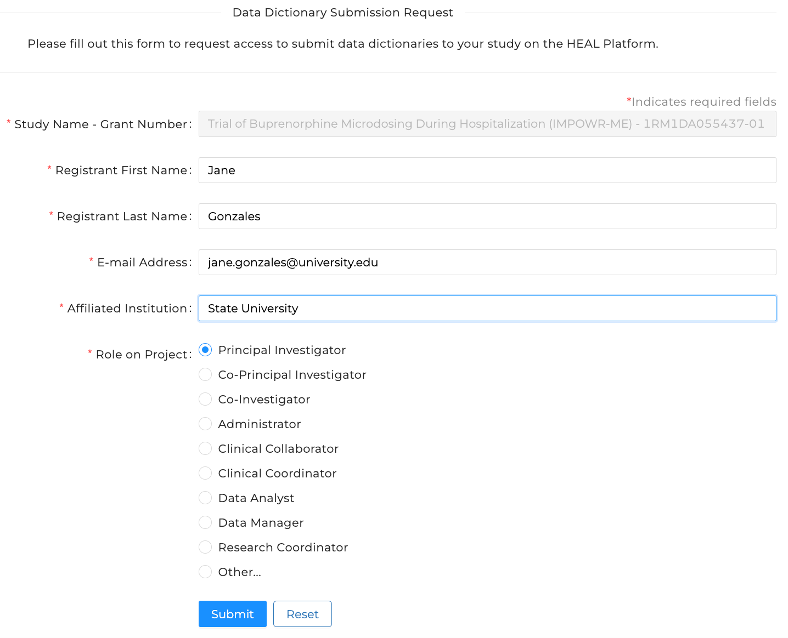

# Request Access to Submit Variable-level Metadata (VLMD)

!!! info 

     In order to submit a Data Dictionary or report CDEs to the Platform, **the study must already be registered on the HEAL Data Platform.** If your study is not yet registered, please see our instructions for how to register your study before submitting VLMD.

     
[How to Register Your Study](../study-registration/index.md){ .md-button }

---

## Request Access to Submit Variable-level Metadata

Requesting Access is the first step in submitting VLMD to the HEAL Data Platform. If you were the person that registered the study on the Platform, you can go directly to [Submit VLMD](#submit-vlmd). If someone else registered the study, follow the steps below to request access to submit VLMD.

### Login to the HEAL Data Platform

Click on the [Login button in the upper right corner](https://healdata.org/portal/login) to log in to the Platform.  

<!-- If you want to play with sizing, you can use something like {: style="height:250px;width:534px"} -->

### Find your study

From the [Discovery Page](https://healdata.org/portal/discovery), find the study for which you wish to request access to submit VLMD.

- Click on the study to open the Study Page
- At the top of the Study Page, select `Request Access to Submit Variable-level Metadata` to navigate to the VLMD Submission Request Form.

!!! info

    If you do not see `Request Access to Submit Variable-level Metadata`, see below for how to proceed.  
    If you see:

    - **`Login to...`** - you are not logged in. [Log in first](https://healdata.org/portal/login), then repeat the instructions above.
    - **`Request Access to Register This Study`** - your study is not yet registered on the HEAL Data Platform. Follow these instructions to [request access and register your study](../study-registration/index.md).  
    - **`Submit Variable-level Metadata`** - You already have access to submit VLMD. Proceed to [submit your data dictionary or CDEs](#submit-vlmd). 

### Complete the VLMD Submission Request Form

- The field `Study Name - Grant Number` will already be filled in.
- You will need to provide your name, your email address, institutional affiliation and role on the project/study.

After submitting, you will see a message indicating it was successfully sent. Within one business day, you will receive an email reporting that your request has been approved. When approved, you will then be able to submit VLMD (either a data dictionary or CDEs) to the Platform.  

## Submit VLMD

You are now ready to submit VLMD! Find instructions for submitting a Data Dictionary or reporting CDEs below:

* [Generate](vlmd_healdata_utils.md) and [Submit a HEAL-compliant Data Dictionary](vlmd_submission.md)
* [Report CDEs](vlmd_submit_CDE.md)
