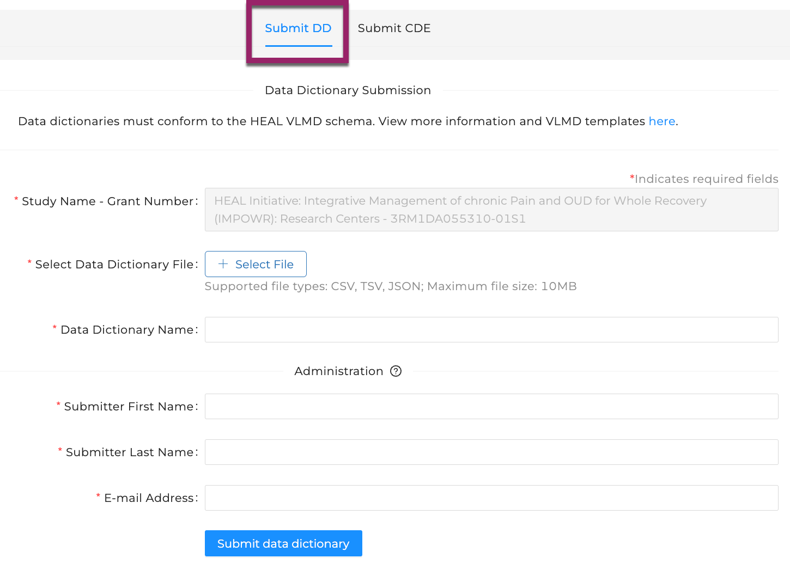

# Submit a Data Dictionary

!!! info 

     In order to submit a Data Dictionary to the Platform, the following conditions must be true:
     
     **1) The study must already be registered:** If your study is not yet registered on the HEAL Data Platform, please see our instructions for how to register your study before submitting VLMD. 
     
     
[How to Register Your Study](../study-registration/index.md){ .md-button }

     **2) You must have access to submit VLMD:** If you are the person who registered your study, you automatically have access. If someone else registered your study, you can follow the instructions below to request access to submit VLMD. 

     
[How to Request Access to Submit VLMD](vlmd_request_access.md){ .md-button }

     **3) The Data Dictionary must conform to the HEAL VLMD schema:** See below for the instructions for how to generate a HEAL-compliant data dictionary. 

      
[Generate a HEAL-compliant Data Dictionary](vlmd_healdata_utils.md){ .md-button }

      **4) Submissions should not include data of any kind**. Submissions containing data will be removed from the Platform.
   
    More information and submission templates can be found [here](https://github.com/HEAL/heal-metadata-schemas/tree/variable-level-metadata).

## Login to the HEAL Data Platform  

Click on the [Login button in the upper right corner](https://healdata.org/portal/login) to log in to the Platform.  

## Find Your Study

From the [Discovery Page](https://healdata.org/portal/discovery), find the study for which you wish to submit a data dictionary.  

- Click on the study to open the Study Page  
- At the top of the Study Page, select `Submit Variable-level Metadata` to navigate to the **Variable-level Metadata Submission Form**.

!!! info

    If you do not see `Submit Variable-level Metadata`, see below for how to proceed.  
    If you see:

    - **`Login to...`** - you are not logged in. [Log in first](https://healdata.org/portal/login), then repeat the instructions above.
    - **`Request Access to Submit Variable-level Metadata`** - you have not yet gotten access to submit VLMD. Follow these instructions to [request access to submit VLMD](vlmd_request_access.md). 
    - **`Request Access to Register This Study`** - your study is not yet registered on the HEAL Data Platform. Follow these instructions to [request access and register your study](../study-registration/index.md). 

## Submit Your Data Dictionary

The VLMD submission form defaults to the Data Dictionary tab (see box at top). 

   

- The `Study` field will already be filled in
- Choose the `Select File` button to browse your local computer for your data dictionary.
  - Only TSV, CSV and JSON files can be submitted
  - While multiple dictionaries can be associated with a study, the process currently supports one submission at a time. Please repeat this process for each data dictionary you wish to submit
  - *Submissions should not include data of any kind.  Submissions containing data will be removed from the Platform.*      
- Enter a name for your data dictionary.  This name will be visible to users on the Platform.  
  - Previously-submitted data dictionary names are displayed, if applicable; using the same name for a new submission will overwrite the existing record.
- To facilitate processing of your submission, some administrative information is needed to allow HEAL Data Platform staff to contact you should the need arise:
    - First and Last name
    - E-mail address
    - *Note that this information is not stored on the Platform, but is simply needed to support you throughout the submission process.*
- Submit your data dictionary

## Processing Your Submission  

Upon receipt of your successful submission, HEAL Data Platform staff will:

- Review your submission for compliance with the HEAL Data Platform variable-level metadata schema 
- Ensure no data are included.  Files containing study-generated data of any kind will not be accepted.
- HEAL Data Platform staff will contact you with any questions and/or to work through any issues that may arise.  If there are no issues, you will be notified when processing is completed.

##  Additional Help

More information about the HEAL variable-level metadata schema, as well as submission templates, can be found [here](https://github.com/HEAL/heal-metadata-schemas/tree/variable-level-metadata).

If you have issues with a submission, or have a general inquiry, please contact us at [heal-support@gen3.org](mailto:heal-support@gen3.org).

