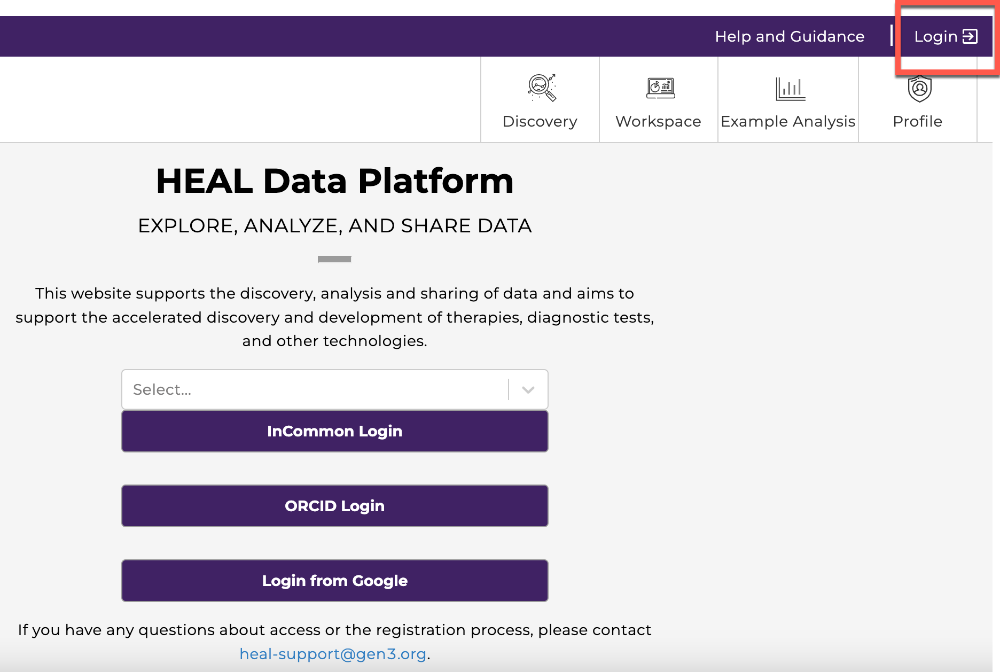
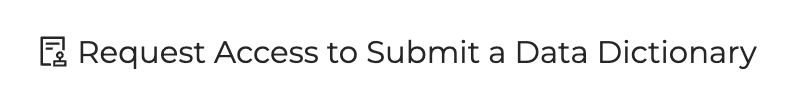
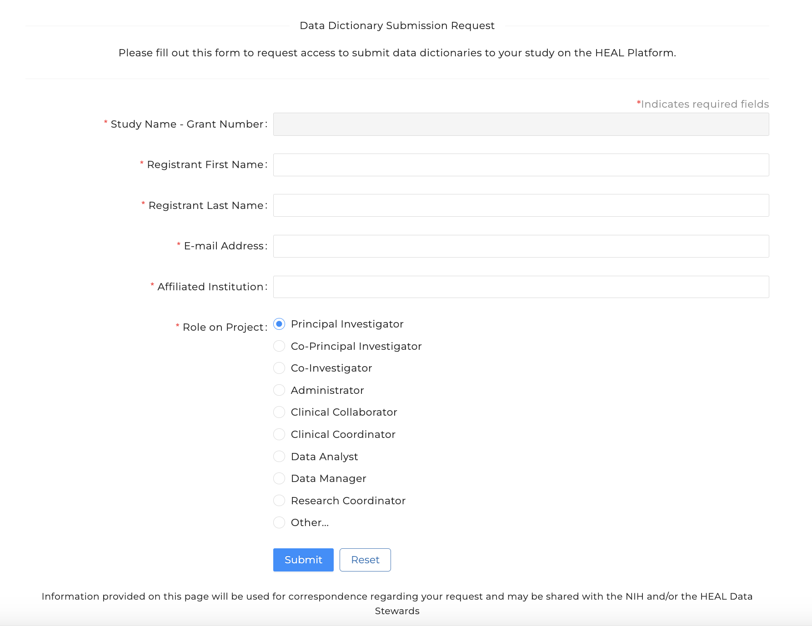

# Submit a Data Dictionary

In order to submit a HEAL-compliant data dictionary and have it be associated with your study on the HEAL Data Platform, that study must first be registered. If you have not already registered your study, please see our instructions on [study registration](../study-registration/index.md).

If you were the team member to register your study, please skip ahead to our instructions on how to [submit a data dictionary to the Platform](#submit-a-data-dictionary_1). 

If your study was registered by another team member, you will first need to request access to submit a data dictionary. Please follow the instructions below. 
<!--
!!! info

     These instructions will show you how to request access to submit a data dictionary to the Platform. 

     If you were the team member to register your study, please skip to our instructions on how to submit a data dictionary to the Platform. 
     
     
[Submit a Data Dictionary](#submit-a-data-dictionary_1){ .md-button }

-->

---

## Request Access to Submit a Data Dictionary

### Login to the HEAL Data Platform

<!-- If you want to play with sizing, you can use something like {: style="height:250px;width:534px"} -->

### Find your study

From the [Discovery Page](https://healdata.org/portal/discovery), find the study you
wish to request access to register.

- Click on the study to open the Study Page
- At the top of the Study Page, select `Request Access to Submit a Data Dictionary`
  to navigate to the Study Registration Access Request form.

### Complete the Data Dictionary Submission Request Form

- The field `Study Name - Grant Number` will already be filled in.
- You will need to provide your name, your email address, institutional
  affiliation and role on the project/study.

After submitting, you will receive an email indicating the status of your
request within one business day. When approved, you will then be able to submit a data dictionary to the Platform.

## Submit a Data Dictionary

!!! info

    Data dictionaries must conform to the HEAL [variable-level metadata schema](https://github.com/HEAL/heal-metadata-schemas/tree/variable-level-metadata/variable-level-metadata-schema). Please view our instructions on how to generate a HEAL-compliant data dictionary if you have not yet done so. 
    
    
[Generate a HEAL-compliant Data Dictionary](vlmd_healdata_utils.md){ .md-button }

    
    Additionally, submissions should not include data of any kind. Submissions containing data will be removed from the Platform.
   
    More information and submission templates can be found [here](https://github.com/HEAL/heal-metadata-schemas/tree/variable-level-metadata).

### Login to the HEAL Data Platform 

### Find Your Study

From the [Discovery Page](https://healdata.org/portal/discovery), find the study for which you wish to submit a data dictionary. _If you were not the member of your team to register the study, you will first need to [request access to submit a data dictionary](vlmd_request_access.md)._

- Click on the study to open the Study Page 
- At the top of the Study Page, select `‘Submit a Data Dictionary’` to navigate to the **Data Dictionary Submission Form**.

!!! info

    A study must be registered in order to submit a data dictionary. 

     If you have not registered your study, please see our instructions on [study registration](../study-registration/)

     If your study was registered by another team member, please see our instructions on [requesting access to submit a data dictionary](). 

### Complete the Data Dictionary Submission Form

   

- The `Study` field will already be filled in
- Choose the `Select File` button to browse your local computer for your data dictionary.
  - Only TSV, CSV and JSON files can be submitted
  - While multiple dictionaries can be associated with a study, the process currently supports one submission at a time. Please repeat this process for each data dictionary you wish to submit
  - *Submissions should not include data of any kind.  Submissions containing data will be removed from the Platform.*      
- Enter a unique name for your data dictionary.  This name will be used to identify the data dictionary for users on the Platform. 
  - Previously submitted data dictionary names are displayed, if applicable - using the same name for a new submission will overwrite the existing record.
- To facilitate processing of your submission, some administrative information is needed to allow HEAL Data Platform staff to contact you should the need arise:
    - First and Last name
    - E-mail address
    - *Note that this information is not stored on the Platform, but is simply needed to support you throughout the submission process.*
- Submit your data dictionary

### Processing Your Submission  

Upon receipt of your successful submission, HEAL Data Platform staff will:

- Review your submission for compliance with the HEAL Data Platform variable-level metadata schema 
- Ensure no data are included.  Files containing study-generated data of any kind will not be accepted.
- HEAL Data Platform staff will contact you with any questions and/or to work through any issues that may arise.  If there are no issues, you will be notified when processing is completed.

###  Additional Help

More information about the HEAL variable-level metadata schema, as well as submission templates, can be found [here](https://github.com/HEAL/heal-metadata-schemas/tree/variable-level-metadata).

If you have issues with a submission, or have a general inquiry, please contact us at [heal-support@datacommons.io](mailto:heal-support@datacommons.io).

