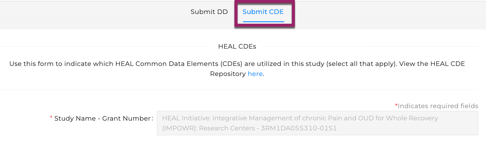
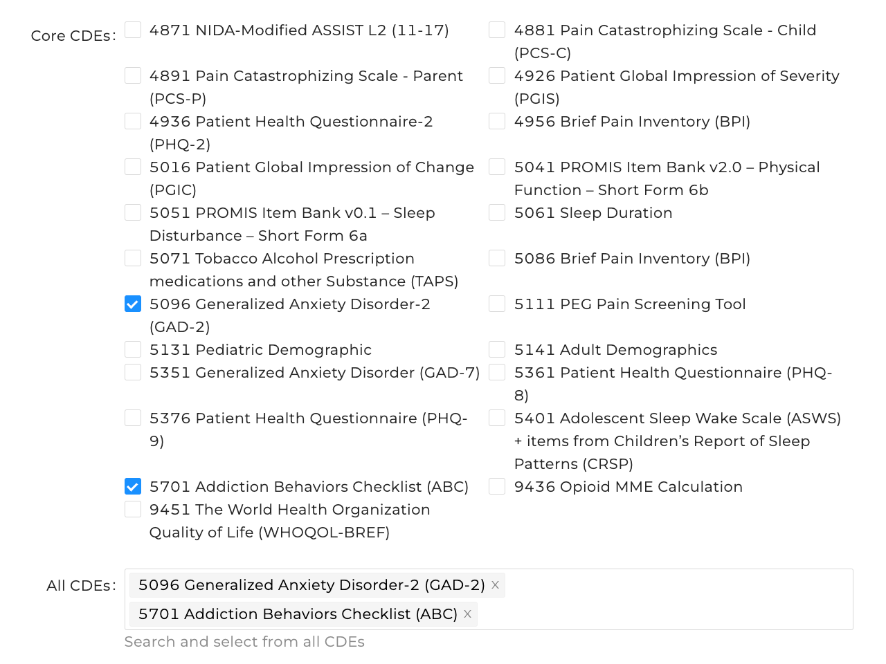
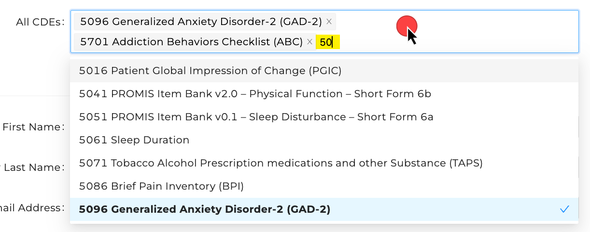
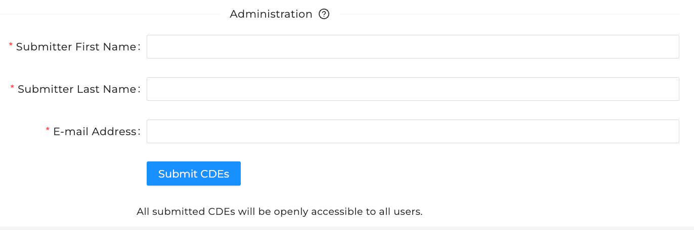
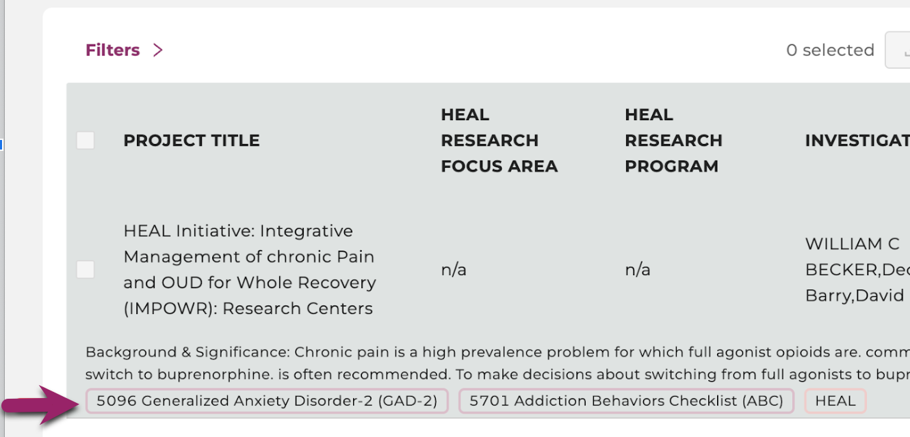

# Submit HEAL CDEs

!!! info 

     In order to report your CDEs to the Platform, the following conditions must be true:
     
     **1) The study must already be registered:** If your study is not yet registered on the HEAL Data Platform, please see our instructions for how to register your study before submitting VLMD. 
     
     
[How to Register Your Study](../study-registration/index.md){ .md-button }

     **2) You must have access to submit VLMD:** If you are the person who registered your study, you automatically have access. If someone else registered your study, you can follow the instructions below to request access to submit VLMD. 

     
[How to Request Access to Submit VLMD](vlmd_request_access.md){ .md-button }
  

## Login to the HEAL Data Platform  

Click on the [Login button in the upper right corner](https://healdata.org/portal/login) to log in to the Platform.  

## Find Your Study

From the [Discovery Page](https://healdata.org/portal/discovery), find the study for which you wish to report CDEs.  

- Click on the study to open the Study Page  
- At the top of the Study Page, select `Submit Variable-level Metadata` to navigate to the **Variable-level Metadata Submission Form**.

!!! info

    If you do not see `Submit Variable-level Metadata`, see below for how to proceed.  
    If you see:

    - **`Login to...`** - you are not logged in. [Log in first](https://healdata.org/portal/login), then repeat the instructions above.
    - **`Request Access to Submit Variable-level Metadata`** - you have not yet gotten access to submit VLMD. Follow these instructions to [request access to submit VLMD](vlmd_request_access.md). 
    - **`Request Access to Register This Study`** - your study is not yet registered on the HEAL Data Platform. Follow these instructions to [request access and register your study](../study-registration/index.md). 

## Report CDEs

The VLMD submission form defaults to the Data Dictionary tab, so click the CDE tab (see box at top) to navigate to the CDE submission form. The `Study` field will already be filled in.

   

Below the `Study` field is a checklist of core CDEs. Check the box for any you wish to associate with your study. As you select CDEs, they will populate in the box at the bottom of the section.

> If you or someone else on your team has already submitted CDEs, you will see these checked and listed in the box. You can update the CDE list by adding or removing CDEs and resubmitting the form.

   

To add Supplemental CDEs not in the core list, you can click in the box beneath the core list and begin typing CDE names or codes to filter other CDEs that include the typed string (see the yellow highlighting). Click the CDE in the filtered list to add.

   

To facilitate processing your submission, some administrative information is needed to allow HEAL Data Platform staff to contact you if necessary:

- First and Last name
- E-mail address
- *Note that this information is not stored on the Platform, but is simply needed to support you throughout the submission process.*

Submit your CDEs by clicking the `Submit CDEs` button.

   

## Viewing the CDEs on Your Study Record  

The CDEs will be updated on your study record on the Platform within 24 hours of your submission. You will then be able to see the CDEs listed in the facets under the study name. 

   

##  Additional Help

If you have issues with a submission, or have a general inquiry, please contact us at [heal-support@gen3.org](mailto:heal-support@gen3.org).

