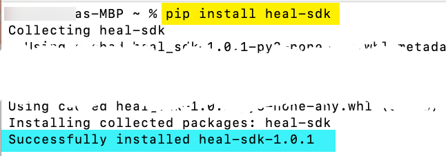
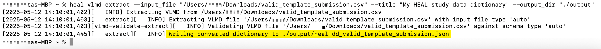
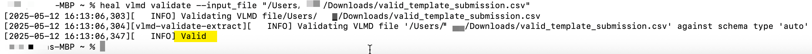
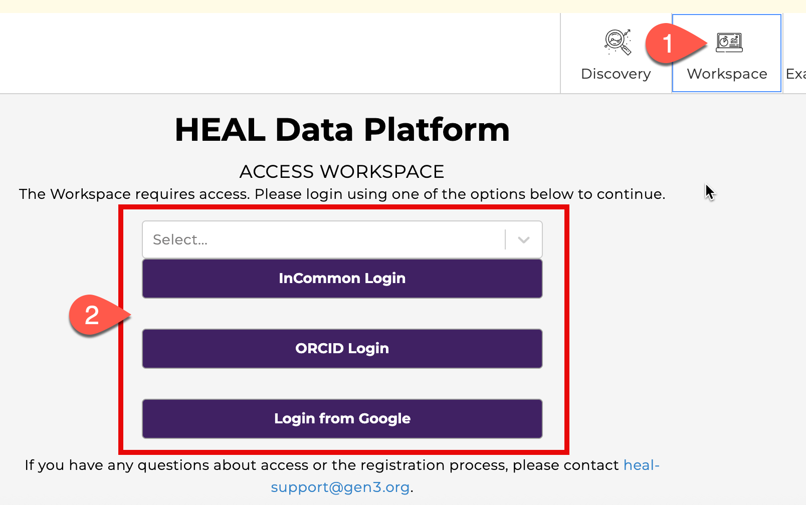
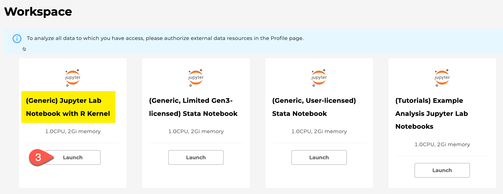
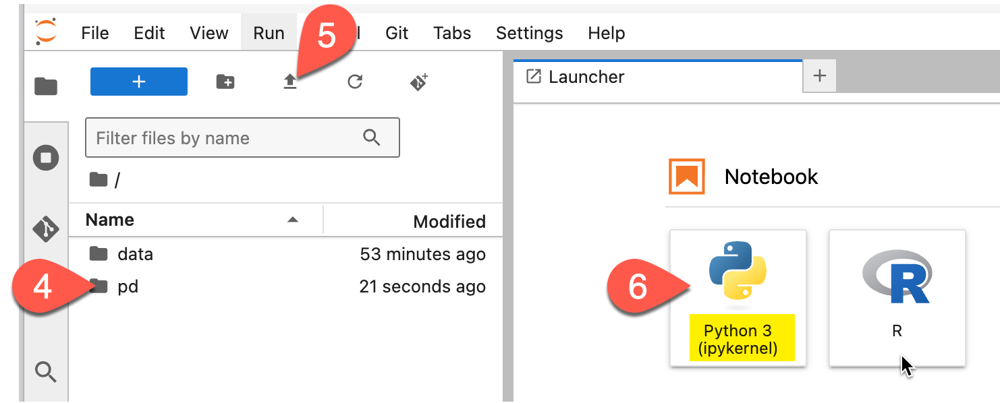
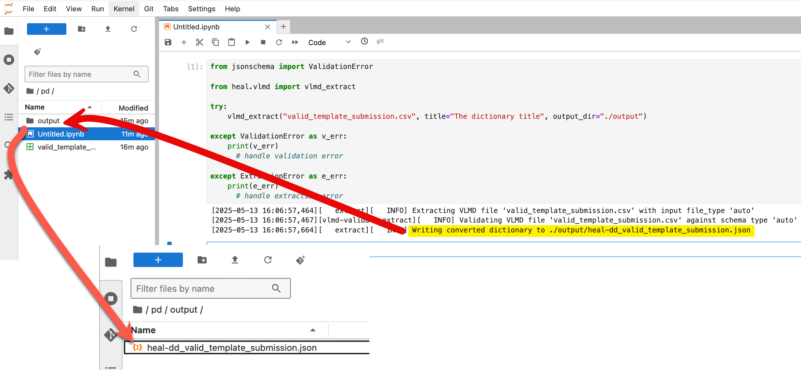
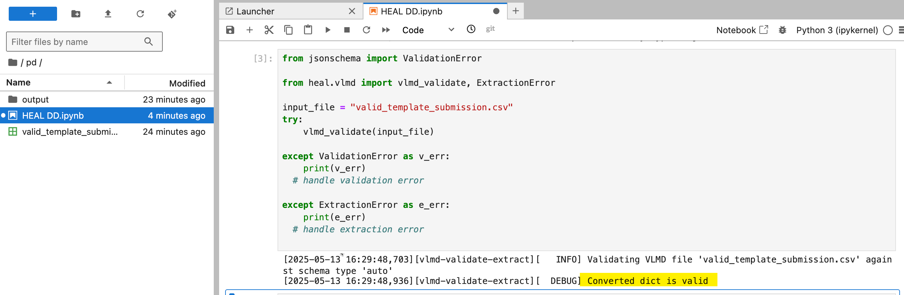

# Generate a HEAL-compliant Data Dictionary

A tool is available to help investigators generate HEAL-compliant variable-level metadata (VLMD) from an existing data dictionary or codebook. This VLMD tool - available as part of the HEAL Software Development Kit (HEAL-SDK) - takes CSV, TSV, JSON or REDCap CSV export files as inputs, and outputs a HEAL-compliant JSON VLMD file that can be uploaded to and associated with your study on the HEAL Data Platform.  

The instructions below describe how to either install and use the VLMD tool on your local machine, or how to use the tool in HEAL workspaces (no installation needed!).  

## Option 1: Use the VLMD Tool on your Local Machine

The VLMD tool can be installed and used directly on your local machine from the command line. Install the tool by following the instructions below:  

1. Open your computer’s command prompt  

      * On a Mac, click the Launchpad icon in the Dock, type “Terminal” in the search field and click on the Terminal icon  
      * On a PC, type “Command Prompt” in the Windows search bar and click on the Command Prompt icon  

2. In the command prompt, type **`pip install heal-sdk`** and push Return/Enter *(see yellow highlight in screenshot below)*. The installation process will take no more than a few minutes to complete.  

      * This step requires Python to be installed; you can [download Python here](https://www.python.org/downloads/) if needed.  
      * Successful installation will report `Successfully installed heal-sdk`, as shown in the blue highlight below

3. Once the tool is installed, you are ready to generate HEAL-compliant VLMD from the command line!  



**View a list of available commands and options:**  
Run the command **`heal vlmd --help`**

**Generate HEAL-compliant VLMD from an existing data dictionary:**  
The VLMD tool can be used to extract HEAL-compliant VLMD from a CSV, TSV, JSON or REDCap CSV data dictionary. Use the following command to extract VLMD from an input file (here, the example file is called `vlmd_for_extraction.csv`):  

**`heal vlmd extract --input_file "vlmd_for_extraction.csv" --title "The dictionary title" --output_dir "./output"`**

* Note that, if you are extracting VLMD from a JSON file that already includes a root-level title field, the root-level title will be included in the extracted VLMD, so the `title` argument in the command can be omitted.  
* Upon successful extraction, the resulting VLMD file will be saved to a subfolder called `output`. (See yellow highlight below)  
* If you get an `input file does not exist` error, try including the path in the filename argument, as shown in the example below. To find the path:  
  
      * **PC**: Select the file in Windows File explorer, then select the three dots at the top of the file explorer window. You will then see an option to Copy Path, which will copy the path to that file location to your clipboard. Paste the path into the input file argument.  
      * **Mac**: Select the file or folder in Finder. Hold down the Option key, Right-click and select `Copy <selected item> as Pathname` to copy the full path to the clipboard. Paste the path into the input file argument. 



**Validate a VLMD file:**  
Check (validate) an existing VLMD file to see if it follows the HEAL specifications after filling out a template or annotating after extracting from a different file format.

Run the command **`heal vlmd validate --input_file "vlmd_for_validation.csv"`** *(where "vlmd_for_validation.csv" is the file name of the VLMD file you are trying to validate)*

* If your VLMD file adheres to the HEAL VLMD schema, the output from this command will include a message that says `Valid`. (See yellow highlight below)  
* If your VLMD file does not validate against the HEAL VLMD schema, the output from this command will indicate what change(s) are necessary to adhere to the schema.  



## Option 2: Use the tool in a HEAL workspace

!!! info "HEAL Workspace documentation"  

     Before using Workspace, please [read our Workspace documentation](../workspaces/heal_workspaces.md) to learn more about Workspace features.
    
   
The VLMD tool also comes pre-installed in workspaces on the HEAL Data Platform, so you can use it without having to install it locally. Access a workspace to use the VLMD tool by following the instructions below:

1. Navigate to [healdata.org](http://healdata.org) and click on the Workspaces tab, where you’ll be prompted to log in.  
      
       * If this is your first time accessing a workspace, you’ll first need to [request access](https://heal.github.io/platform-documentation/workspaces/heal_workspace_registration/).  

        

2. From within the workspace, launch the (Generic) Jupyter Lab Notebook with R Kernel workspace image.  

    

3. Once the workspace is launched, do the following steps in order:  

       * Double-click on the `/pd` (persistent drive) folder (#4) in the left navigation pane to change to the /pd directory
       * Once in /pd, click the Upload icon (#5) to upload your data dictionary file to be analyzed or converted. *Please note that only files saved to the /pd directory will persist after your workspace session is terminated.* 
       * Click on the Python Jupyter notebook icon (#6) to open an empty notebook in the /pd.

        

Now you are ready to generate HEAL-compliant VLMD!

**Generate HEAL-compliant VLMD from an existing data dictionary:**  
The extract module generates a HEAL-compliant VLMD file from a CSV, TSV, JSON or REDCap CSV data dictionary. Upon successful extraction, the resulting VLMD file will be saved to a subfolder called `output`; this folder will be in the /pd if you ran the notebook from inside the /pd. (See yellow highlight and red arrows below)  

The **`vlmd_extract()`** method raises a **`jsonschema.ValidationError`** for an invalid input file, and raises **`ExtractionError`** for any other type of error.

``` py title="Example extraction code for HEAL workspace"  
from jsonschema import ValidationError

from heal.vlmd import vlmd_extract

try:
    vlmd_extract(
        "vlmd_for_extraction.csv", 
        title="The dictionary title", 
        output_dir="./output"
    )

except ValidationError as v_err:
    print(v_err)
    # handle validation error

except ExtractionError as e_err:
    print(e_err)
    # handle extraction error
```



**Validate a VLMD file:**  
This module checks (validates) an existing VLMD file to see if it follows the HEAL specifications after filling out a template or annotating after extracting from a different file format.

The **`vlmd_validate()`** method raises a **`jsonschema.ValidationError`** for an invalid input file and will raise an **`ExtractionError`** if the input_file cannot be converted.

``` py title="Example validation code for HEAL workspace"  
from jsonschema import ValidationError

from heal.vlmd import vlmd_validate, ExtractionError

input_file = "vlmd_dd.json"  
try:  
    vlmd_validate(input_file)

except ValidationError as v_err:
    print(v_err)
    # handle validation error

except ExtractionError as e_err:
    print(e_err)
    # handle extraction error
```

* If your VLMD file adheres to the HEAL VLMD schema, the output from this command will include a message that says `Valid` (see highlight in the screenshot below).  
* If your VLMD file does not validate against the HEAL VLMD schema, the output from this command will indicate what change(s) are necessary to adhere to the schema.



## Next Steps  

Once you’ve created your HEAL-compliant VLMD, you’re now ready to submit it to the HEAL Data Platform! Please see our instructions on submitting a data dictionary:

* [How to Submit a Data Dictionary](https://heal.github.io/platform-documentation/vlmd/vlmd_submission/)

If you need any help generating a HEAL-compliant data dictionary with the VMLD Tool, or have a general inquiry, please contact us at [heal-support@gen3.org](mailto:heal-support@gen3.org).
