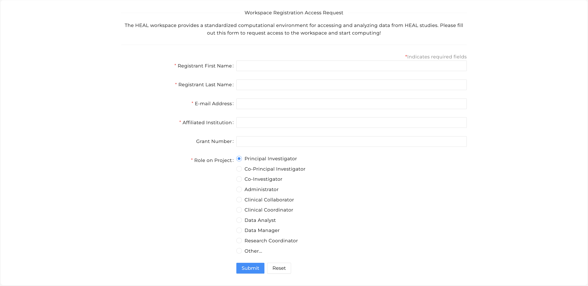
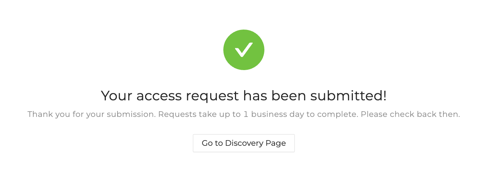
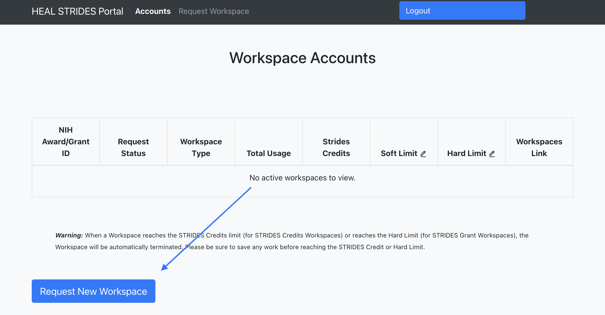
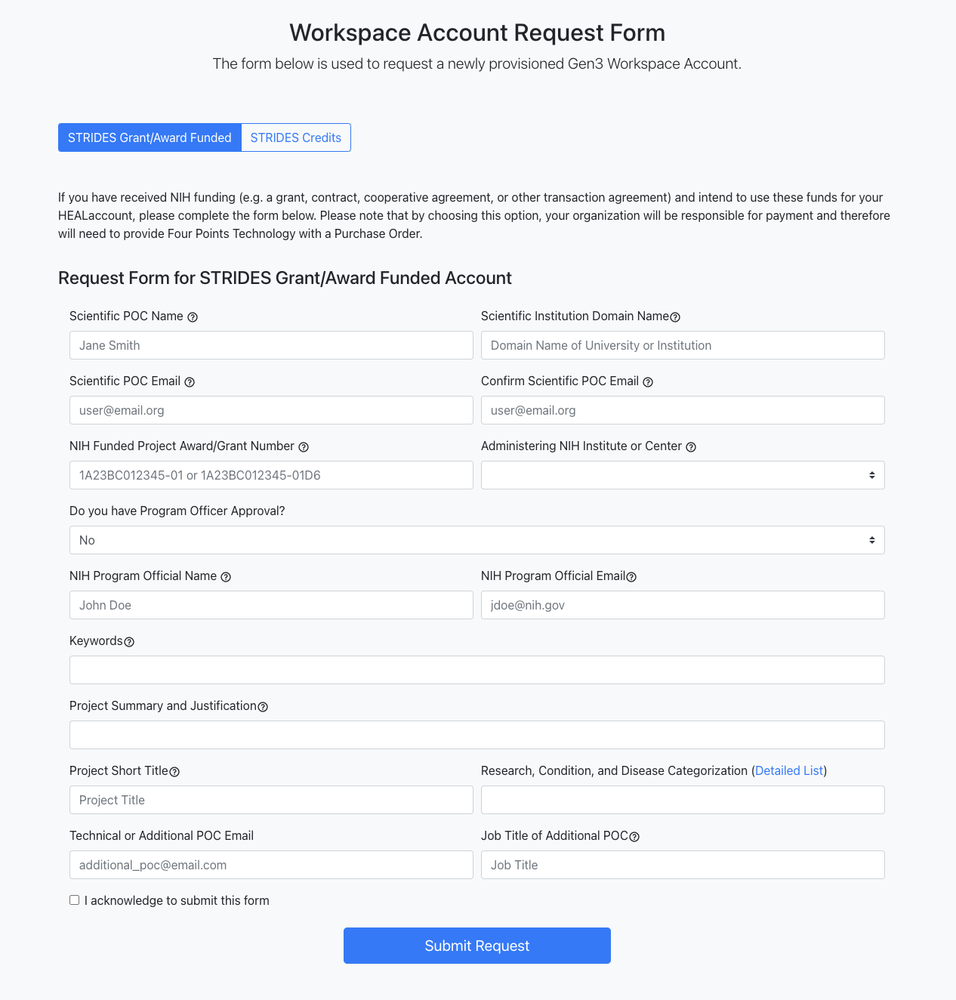
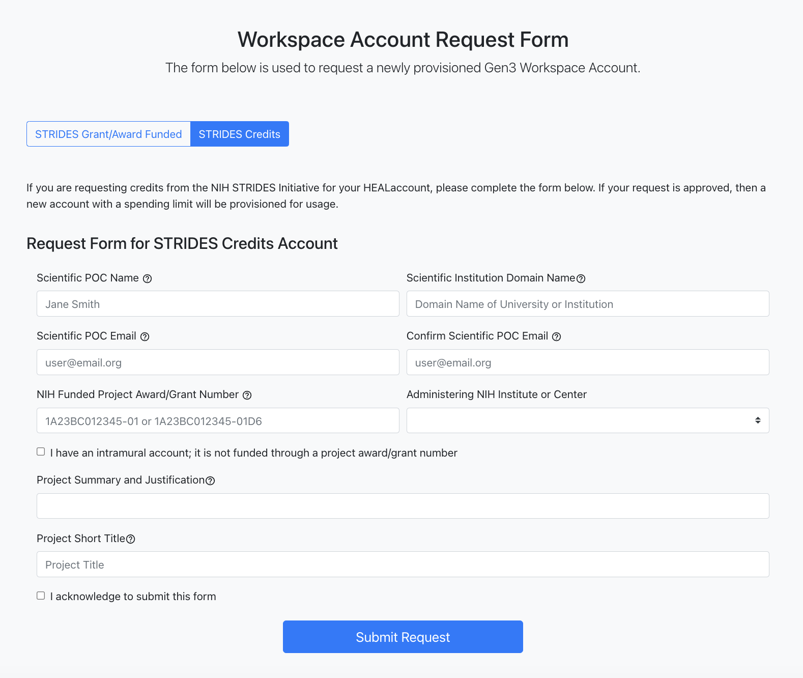

# Register for HEAL Data Platform Workspaces

To start exploring workspaces on the HEAL Data Platform, users can apply for Temporary Trial Access. Extended access to workspaces on the HEAL Data Platform is granted using an NIH STRIDES workspace account, which can be requested after trial access is provisioned. Please see below for more details.

## Guidelines for Requesting Temporary Trial Access to HEAL Data Platform Workspaces

For new users without workspace access, please follow these steps:

1. Login to [the HEAL Data Platform](https://healdata.org/portal/login).
  *Please make a note of your specific login username; this is the username that will have access to workspaces.*
   
2. Click on the [Workspace tab](https://healdata.org/portal/workspace). 
      
   
      This opens the Workspace Access Request form

3. Fill in the details and submit the form shown below.

      

4. The form should be completed only once. Following submission, users will see a success message and a link back to the Discovery page.

      
         
      If you see any other message besides a success message, please reach out to us at [heal-support@datacommons.io](mailto:heal-support@datacommons.io). We may not have received your access request.
         
5. Users will receive an email notifying them that the request has been received. 

6. Users will receive another email notifying them the temporary trial access request has been approved. They should then be able to access workspaces on the HEAL Data Platform. Please note that the timeline for this approval can be a few business days. If you have not received a response after a few business days, please reach out to [heal-support@datacommons.io](mailto:heal-support@datacommons.io) to check the status of your access request.*

## Guidelines for Requesting Extended Access to HEAL Data Platform Workspaces using STRIDES

> Please Note: The process for granting access for a workspace account through NIH STRIDES can take up to two weeks.

The workspace account can be funded through **NIH STRIDES** (NIH **S**cience and **T**echnology **R**esearch **I**nfrastructure for **D**iscovery, **E**xperimentation, and **S**ustainability). The NIH STRIDES Initiative allows NIH-funded researchers to explore the use of cloud environments to streamline NIH data use by partnering with commercial providers.

By leveraging the STRIDES Initiative, NIH and NIH-funded institutions can begin to create a robust, interconnected ecosystem that breaks down silos related to generating, analyzing, and sharing research data.

NIH-funded researchers with an active NIH award may take advantage of the STRIDES Initiative for their NIH-funded research projects. Eligible researchers include NIH intramural researchers and awardees of NIH contracts, other transaction agreements, grants, cooperative agreements, and other agreements. More information on NIH STRIDES and how to gain access can be found [here](https://datascience.nih.gov/strides). Please see below for registration steps

1. Users will receive an invitation via email to register for an NIH STRIDES workspace account. Users can click the link in the invitation email or request a workspace account by visiting [https://healportal.org/](https://healportal.org/) and logging in.
        

2. After authorization, users will be able to see active workspace accounts and credits.

      To request a workspace account, select "Request New Workspace" on the landing page.
        

3. Choose one of the two options a) STRIDES Grant/Award Funded or b) STRIDES Credits to request a workspace account.
        
      

      *For information on the NIH STRIDES options, please refer to the [official page](https://datascience.nih.gov/strides)*.

    * The **STRIDES Grant/Award Funded** form can be selected if researchers have received NIH funding (e.g. a grant, contract, cooperative agreement, or other transaction agreement) and intend to use these funds for a HEAL Data Platform Workspace account. With this option, the researchers' organization will be responsible for payment.

        

    * Select the **STRIDES Credits** form to request credits from the NIH STRIDES Initiative for the HEAL Data Platform Workspace account. With this option, once the request is approved, a new account with a spending limit of $XXX will be provisioned for usage.

        

4. Submit the request. Note that the process of granting access for a workspace account can take up to two weeks and users will be notified. Following the approval, users will see the current workspace accounts and credits on the landing page.

