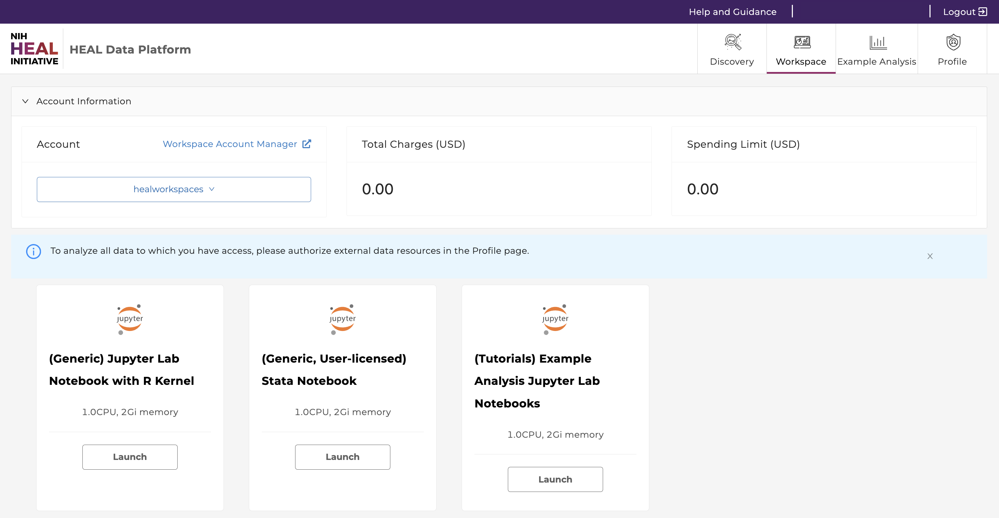
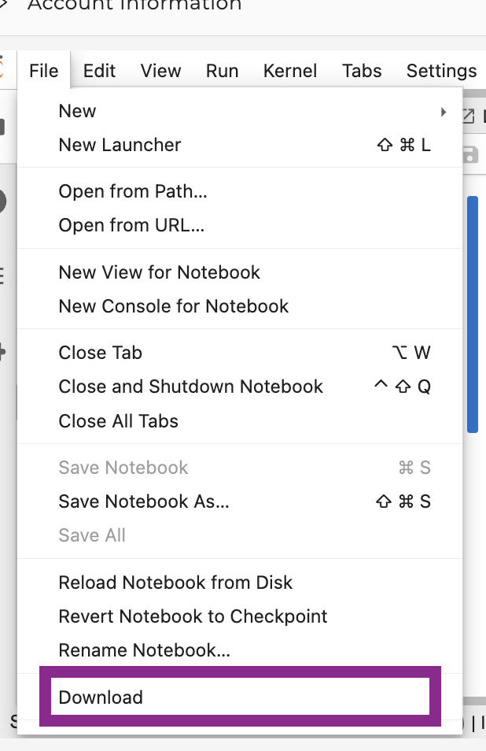

# Using Workspaces on the HEAL Data Platform

!!! info
      To use workspaces, you must first register for workspace access as described on the [Workspace Registration page](heal_workspace_registration.md).
<!--
Workspaces are secure data analysis environments in the cloud that can access data from one or more data resources in the HEAL Data Ecosystem. By default, workspaces include Jupyter notebooks, Python and R, but can be configured to host virtually any application, including analysis workflows, data processing pipelines, or data visualization tools.

> New to Jupyter? Learn more about the popular tool for data scientists on [Jupyter.org](https://jupyter.org/) (disclaimer: CTDS is not responsible for the content). -->

## Guidelines to get started in Workspaces

Once you have access to workspaces, use this guide below to get started with analysis work in workspaces.

1. Log in via [https://healdata.org/portal/login](https://healdata.org/portal/login) to access workspaces.

2. After navigating to [https://healdata.org/portal/workspace](https://healdata.org/portal/workspace), you will discover a list of pre-configured virtual machine (VM) images, as shown below.

      

      - **(Generic) Jupyter Notebook with R kernel:** Choose this VM if you are familiar with setting up Python- or R-based Notebooks, or if you just exported one or multiple studies from the Discovery Page and want to start your custom analysis.
      - **Tutorial Notebooks:** Explore our [Jupyter Notebook tutorials](https://healdata.org/portal/resource-browser) written in Python or R, which analyze data pulled from various sources on the HEAL Data Platform These are excellent resources for code to use to analyze data from HEAL, and examples that illustrate the variety of data and analyses available through HEAL.

3. Click “Launch” on any of the workspace options to spin up a copy of that VM. The status of launching the workspace is displayed after clicking on “Launch”. Note: Launching the VM may take several minutes.

      

4. After launching, the home folder is displayed. One of these folders is your persistent drive ("/pd").

      

5. Select the /pd folder. New files or licenses should be saved in the the /pd directory if users need to access them after restarting the workspaces. Only files saved in the /pd directory will remain available after termination of a workspace session.

      {: style="height:400px"}

      - **Attention:** Any personal files in the folder “data” will be lost. Personal files in the directory /pd will persist.
      - Do not save files in the "data" or “data/healdata.org” folders.
      - The folder “healdata.org” in the “data” folder will host the data files you have exported from the Discovery Page. Move these files to the /pd directory if you do not want to have to export them again.
      - /pd has a capacity limit of 10GB.

6. Start a new notebook under “Notebook” in the Launcher tab. Click the tiles in the launcher and choose between Python 3 or R Studio as the base programming language.

      *Note: You can open and run multiple notebooks in your workspace; however, the generic, tutorial and nextflow workspace images are currently separate Docker images. There is no functionality to combine them or run nextflow in the Tutorial or Generic images. This may be available in the future, after further testing and development activities.*

      

7. **Experiment away!** Code blocks are entered in cells, which can be executed individually or all at once. Code documentation and comments can also be entered in cells, and the cell type can be set to support Markdown.

      Results, including plots, tables, and graphics, can be generated in the workspace and downloaded as files.

8. Do not forget to terminate your workspace when you are done with your session. Unterminated workspaces can continue to accrue computational costs. **Note: workspaces automatically shut down after 90 minutes of [idle time](#automatic-workspace-shutdown).**

{: style="height:200px"}

Further reading: read more about how to download data files into the Workspaces [here](downloading_files.md).

## Upload, Save, and Download Files/Notebooks

You can **upload** data files or Notebooks from your local machine to the home directory by clicking on “Upload” in the top left corner. Access the uploaded content in the Notebook (see below).

You can then **save** the notebook by clicking "File" - "Save as", as shown below.

{: style="height:400px"}

You can then **download** notebooks by clicking "File" - "Download", as shown below. Download the notebook, for example, as ".ipynb".

{: style="height:400px"}

## Environments, Languages, and Tools

The following **environments** are available in the workspaces:

- Jupyter Lab

{: style="height:100px"}

The following **programming languages** are available in Jupyter Notebooks:

- R
- Python 3

The following **tools** are available in Jupyter Notebooks:

- GitHub ([read GitHub documentation](https://docs.github.com/en))

## Python 3 and R in Jupyter

Both Python 3 and R are available in Jupyter Notebooks.

Basic Python or R packages , such as PyPI or CRAN, as well as many tools typical for data analysis are already included in the base workspace images without further installation required. For Python and R, users can start a new notebook with one of the tiles under "Notebook", as shown below.

## Automatic Workspace Shutdown

**Warning:** When a HEAL Workspace reaches the STRIDES Credits limit for STRIDES Credits Workspaces, or reaches the Hard Limit for STRIDES Grant Workspaces, the Workspace will be automatically terminated. Please be sure to save any work before reaching the STRIDES Credit or Hard Limit.

**Warning:** Workspaces will also automatically shut down after 90 minutes of idle time. A pop-up window will remind users to navigate back to the workspaces page in order to save the data.

<!-- Links and Images -->

